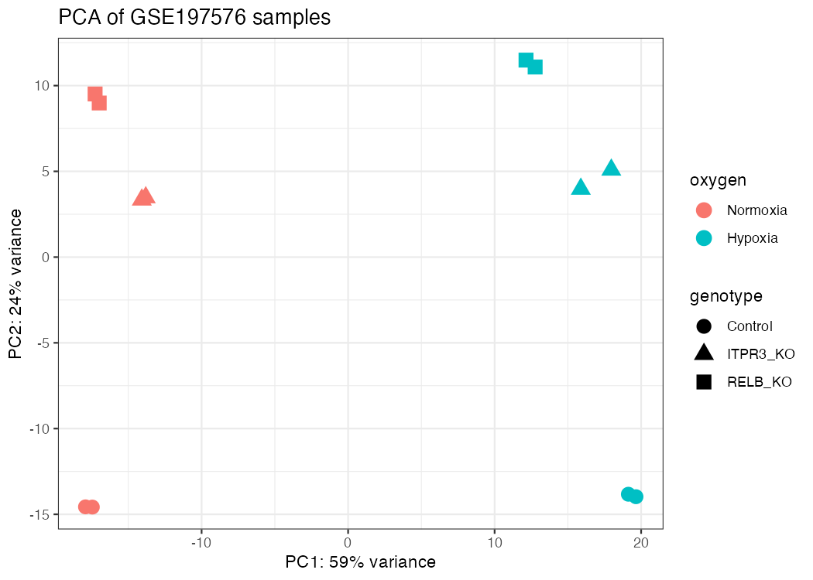
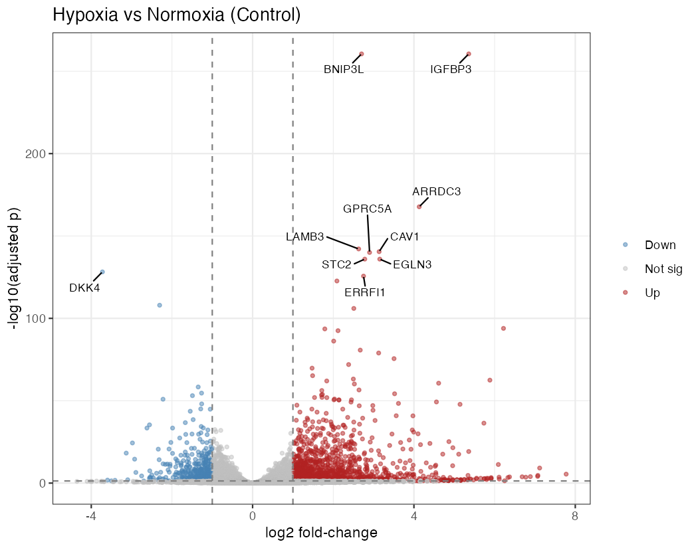
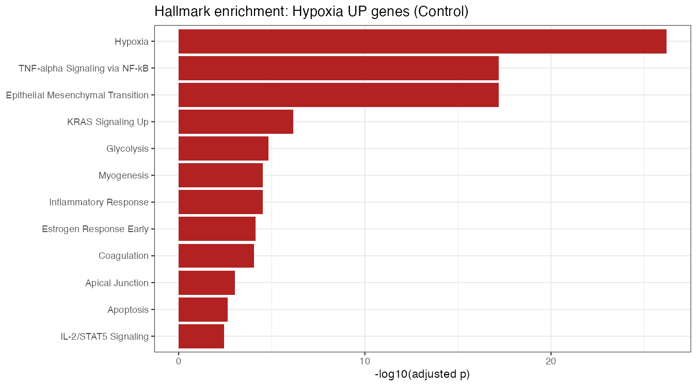

# RNA-seq Analysis of Hypoxia Response in ITPR3 / RELB Knockout Colorectal Cancer Cells

A reproducible bulk RNA-seq differential expression analysis of **GEO dataset
[GSE197576](https://www.ncbi.nlm.nih.gov/geo/query/acc.cgi?acc=GSE197576)**, built
end-to-end with [Claude Code](https://code.claude.com). The project doubles as a
worked example of **using an AI coding agent to go from a raw GEO accession to
validated biological insight.**

---

## TL;DR — what was found

Starting from a raw gene-count matrix, this analysis:

- Identified **~5,000 genes** that respond to hypoxia (0.5% O₂) in SW480 cells.
- **Validated the pipeline** — canonical hypoxia markers (*CA9*, *VEGFA*, *PGK1*,
  *NDRG1*, *EGLN3*) are all strongly up-regulated, and the #1 enriched pathway is
  literally **Hallmark "Hypoxia."**
- Showed that the genes whose hypoxia response **depends on ITPR3 or RELB** are most
  enriched for **TNF-α / NF-κB signaling** — consistent with the published
  **ITPR3 → RELB → NF-κB** axis (RELB is a non-canonical NF-κB transcription factor).

---

## The biology

The dataset is from **Moy et al., 2022, *Developmental Cell*** (PMID 35487218),
which identified the **ITPR3/calcium/RELB axis** as a driver of colorectal cancer
metastatic liver colonization, in part by helping cells survive **hypoxia**. This
experiment knocks out **ITPR3** or **RELB** in SW480 colorectal cancer cells and
compares **normoxia vs hypoxia** — a 2 × 3 factorial design with 2 replicates
(12 samples). See [`docs/background_research.md`](docs/background_research.md) for a
cited literature summary.

---

## Key results

### Quality control — the experiment worked
Principal component analysis cleanly separates samples by oxygen (PC1, 59%) and by
genotype (PC2, 24%); replicates are tight.



### Differential expression — the hypoxia response
Volcano plot of hypoxia vs normoxia in control cells. Red = up, blue = down. Top
genes are classic hypoxia targets.



### Pathway enrichment — the biology, validated
The hypoxia-up genes are dominated by the **Hypoxia** Hallmark set, followed by
**NF-κB signaling**, **EMT**, and **glycolysis**.



| Gene set tested | Top enriched pathway |
|---|---|
| Hypoxia-up genes | **Hypoxia** (then NF-κB, EMT, Glycolysis) |
| ITPR3 × hypoxia interaction | **TNF-α via NF-κB** |
| RELB × hypoxia interaction | **TNF-α via NF-κB** |

---

## Pipeline

```
rnaseq-analysis/
├── data/        GSE197576 raw gene-count matrix (.tsv.gz)
├── scripts/     01_setup → 05_enrichment  (numbered, run in order)
├── results/     figures (.png) + DE tables (.csv)
├── docs/        cited biological background
└── README.md
```

| Script | Step | Output |
|--------|------|--------|
| `01_setup.R`      | Load counts, build sample metadata, build DESeqDataSet | `dds_step1.rds` |
| `02_qc.R`         | VST, PCA, sample-distance heatmap | `qc_*.png` |
| `03_deseq.R`      | DESeq2 model + 5 contrasts, marker-gene validation | `DE_*.csv` |
| `04_plots.R`      | Volcano plots + top-gene heatmap | `volcano_*.png`, `heatmap_*.png` |
| `05_enrichment.R` | Pathway enrichment (Enrichr: Hallmark / GO / KEGG) | `enrich_*` |

### Reproduce

Requires R (≥ 4.4) with `DESeq2`, `ggplot2`, `pheatmap`, `ggrepel`, `enrichR`.
Run **from the project root**, in order:

```bash
Rscript scripts/01_setup.R
Rscript scripts/02_qc.R
Rscript scripts/03_deseq.R
Rscript scripts/04_plots.R
Rscript scripts/05_enrichment.R   # needs internet (Enrichr)
```

---

## Built with Claude Code

This analysis was driven end-to-end with Claude Code, exercising:

- **Plan mode** — designed the analysis and approved it before any code was written
- **A multi-agent research workflow** (`deep-research`) — surfaced the source paper
  and biological context, with adversarial fact-checking
- **Background tasks** — package installs ran while work continued
- **`/code-review`** — a multi-agent review caught real issues (a mislabeled log,
  an `-log10(0)` edge case, reproducibility gaps), which were fixed and re-verified

---

## Caveats (honest notes)

- **Fold-change shrinkage** was not applied: the `normal` method does not support
  interaction designs, and `apeglm`/`ashr` were unavailable in the environment.
  P-values and significance are unaffected; reported log2 fold-changes are unshrunken.
- **Enrichment background:** Enrichr scores against its genome-wide background rather
  than the ~20,759 expressed/tested genes, which can modestly inflate significance.
- **Interaction terms:** for the interaction contrasts, the log2 fold-change is a
  *difference-of-differences* (how the hypoxia response changes in a knockout), not a
  simple up/down expression change.

---

## References

- Moy et al. 2022, *Developmental Cell* — https://pubmed.ncbi.nlm.nih.gov/35487218/
- Love, Huber & Anders 2014, *Genome Biology* (DESeq2)
- Kuleshov et al. 2016, *Nucleic Acids Research* (Enrichr)
